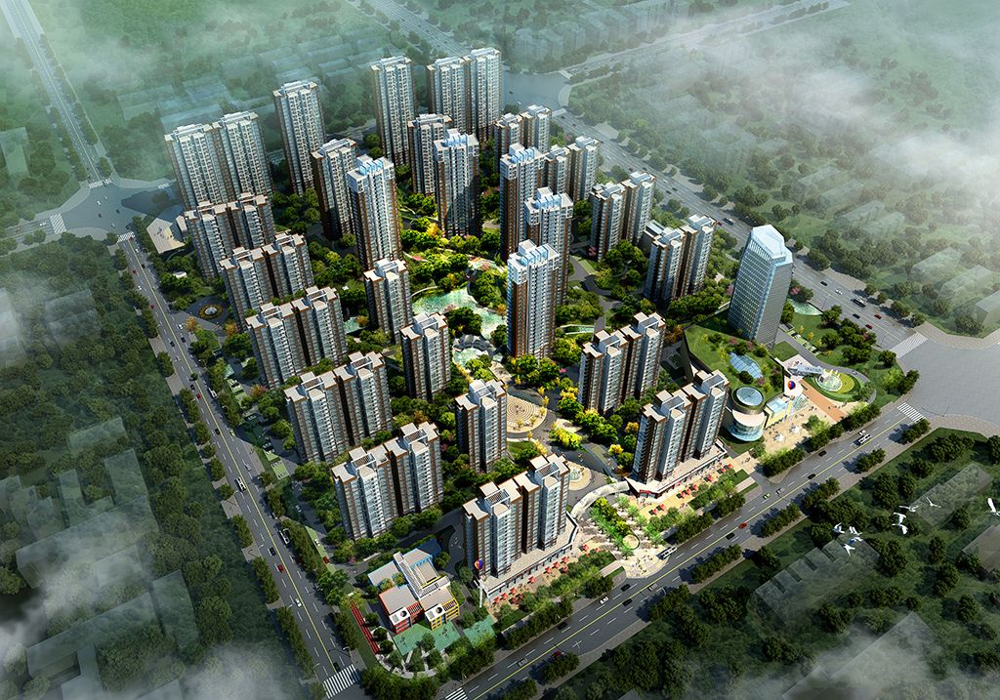

# 
装修笔记

## 小区信息
- 占地面积：146000平米
- 建筑面积：450000平米
- 建筑年代：2015年建成
- 楼栋总数：26栋
- 房屋总数：2721户
- 车位总数：1200
- 容 积 率：2.11
- 绿 化 率：50%
- 物 业 费：1.36元/平米/月

## 户型信息
- 总层数：28层
- 所在层数：19层
- 建筑面积：129.25平米
- 公摊面积：30.60平米
- 专有面积：98.65平米
- 使用面积：90平左右

